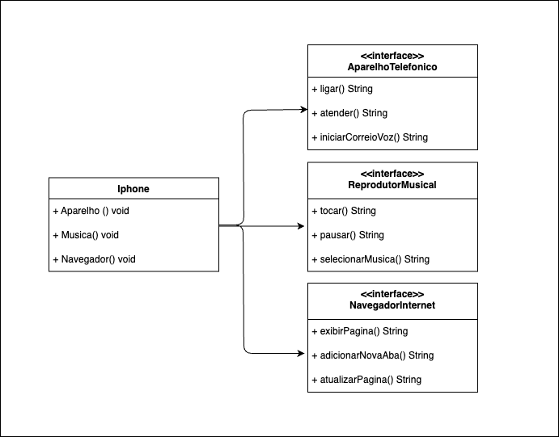

# Desafio UML iPhone

Este projeto é uma implementação do desafio proposto no vídeo de lançamento do iPhone 2017. O objetivo é criar uma representação em Java dos papéis do iPhone como um Reprodutor Musical, Aparelho Telefônico e Navegador na Internet.

## Diagrama UML

  

## Descrição do Desafio

Com base no vídeo de lançamento do iPhone https://www.youtube.com/watch?v=9ou608QQRq8, o desafio é elaborar uma diagramação UML das classes e interfaces que representam os papéis do iPhone. Em seguida, essas classes e interfaces devem ser implementadas como arquivos .java.

## Pré-requisitos

- Lógica de programação e Programação Orientada a Objetos (POO)
- Conhecimentos básicos em Java
- Computador com sistema operacional de sua preferência (Windows, Linux, Mac OS)
- IDE (Visual Studio Code, Eclipse, etc)

## Como executar o projeto

1. Clone o repositório
2. Abra o projeto na sua IDE preferida
3. Execute a classe `iPhone.java`

## Contribuição

Este é um projeto aberto para contribuições. Sinta-se à vontade para criar issues ou pull requests.